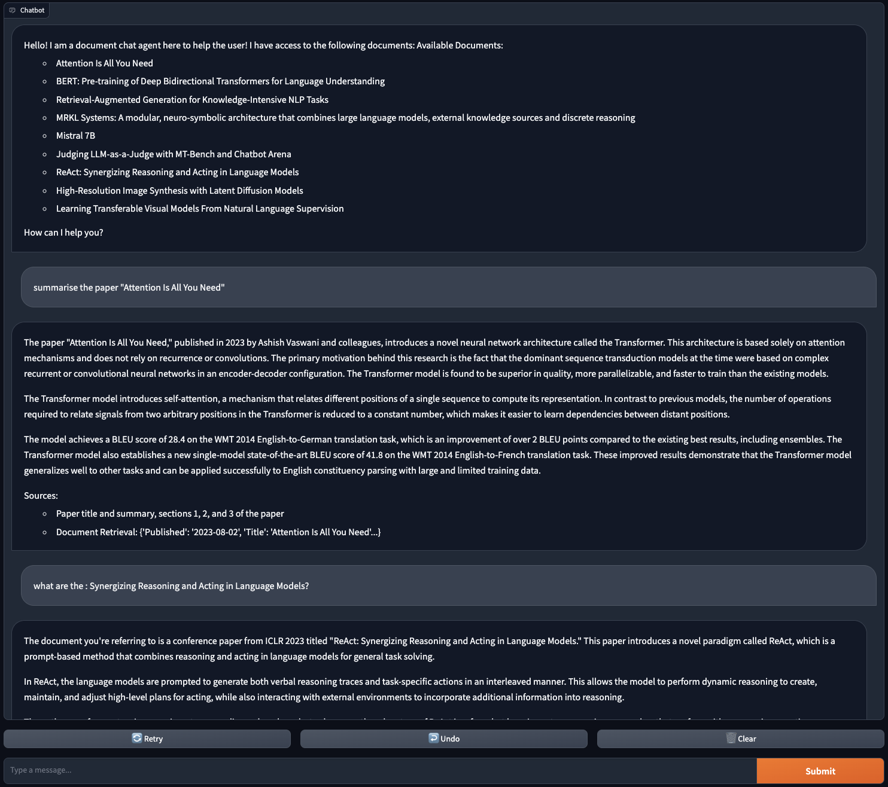

# RAG Agent with LangChain and NVIDIA ChatGPT

This repository contains an implementation of a RAG (Retrieval-Augmented Generation) Agent using LangChain and NVIDIA ChatGPT. The project aims to create a conversational AI system that can retrieve relevant information from a knowledge base and generate human-like responses.

## Table of Contents

- [Introduction](#introduction)
- [Features](#features)
- [Installation](#installation)
- [Usage](#usage)
  - [Environment Setup](#environment-setup)
  - [Running the RAG Agent](#running-the-rag-agent)
  - [Customizing the Knowledge Base](#customizing-the-knowledge-base)
  - [Interacting with the Agent](#interacting-with-the-agent)
- [Configuration](#configuration)
- [Examples](#examples)
- [Contributing](#contributing)
- [License](#license)

## Introduction

The RAG Agent combines the power of retrieval and generation to provide accurate and contextually relevant responses to user queries. By leveraging LangChain's framework and NVIDIA ChatGPT's language generation capabilities, the agent can engage in meaningful conversations while drawing upon a knowledge base to provide informed answers.

## Features

- Retrieval-Augmented Generation (RAG) for enhanced conversational AI
- Integration with LangChain for seamless pipeline construction
- Utilization of NVIDIA ChatGPT for natural language generation
- Customizable knowledge base for domain-specific information retrieval
- Interactive chat interface powered by Gradio
- Support for streaming responses for a more natural conversation flow
- Extensible architecture for easy customization and enhancement

## Installation

1. Clone the repository:

   ```shell
   git clone https://github.com/your-username/rag-agent.git
   ```

2. Install the required dependencies:

   ```shell
   pip install -r requirements.txt
   ```

3. Set up the necessary API keys and configurations (see [Configuration](#configuration) section).

## Usage

### Environment Setup

Before running the RAG Agent, ensure that you have set up the necessary environment variables and configurations. This includes providing the NVIDIA API key and any other required settings.

### Running the RAG Agent

To start the RAG Agent, run the following command:

   ```shell
   python server_app.py
   ```

This will launch the server and make the agent available for interaction.

### Customizing the Knowledge Base

The RAG Agent relies on a knowledge base to retrieve relevant information. You can customize the knowledge base by modifying the `KnowledgeBase` class in the `server_app.py` file. Update the fields and their descriptions to match your specific domain or use case.

### Interacting with the Agent

Once the server is running, you can interact with the RAG Agent using the provided chat interface. Simply open the URL displayed in the console and start chatting with the agent. You can ask questions, provide additional context, and engage in a conversation.

## Configuration

The RAG Agent requires certain configurations to function properly. Make sure to set the following:

- **NVIDIA API Key**: Set the `NVIDIA_API_KEY` environment variable with your NVIDIA API key.
- **Model Configuration**: Update the `ChatNVIDIA` initialization in the `server_app.py` file to specify the desired model and any other necessary parameters.

## Examples

Here are a few examples of how you can interact with the RAG Agent:

- **User**: "What is the capital of France?"
  **Agent**: "The capital of France is Paris."

- **User**: "Can you tell me about the history of the Eiffel Tower?"
  **Agent**: "The Eiffel Tower is an iconic landmark located in Paris, France. It was constructed from 1887 to 1889 as the entrance arch for the World's Fair. Designed by Gustave Eiffel, the tower stands at a height of 324 meters (1,063 feet) and was the tallest man-made structure in the world until 1930. Initially met with criticism, the Eiffel Tower has become a global cultural icon of France and a popular tourist destination, attracting millions of visitors each year."





Feel free to explore more examples and test the agent's capabilities based on your specific knowledge base and domain.

## Contributing

Contributions to the RAG Agent project are welcome! If you find any issues or have suggestions for improvements, please open an issue or submit a pull request. Make sure to follow the existing code style and provide detailed information about your changes.

```

This README provides a comprehensive overview of your RAG Agent project, including its features, installation instructions, usage guidelines, configuration details, and examples. It also includes sections for contributing and licensing information. You can copy the contents of this README and save it as `README.md` in your project repository.